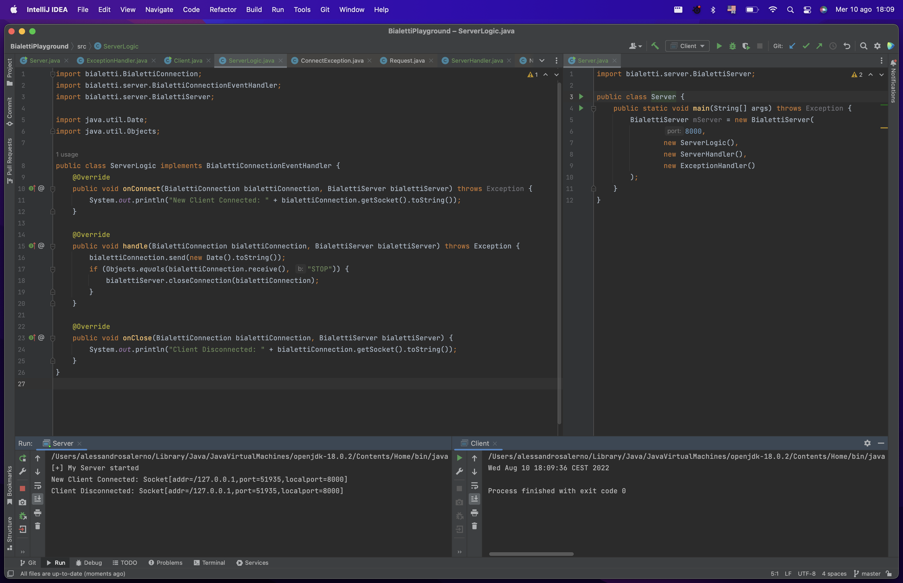

[![Contributors][contributors-shield]][contributors-url]
[![Forks][forks-shield]][forks-url]
[![Stargazers][stars-shield]][stars-url]
[![Issues][issues-shield]][issues-url]
[![MIT License][license-shield]][license-url]


<!-- PROJECT LOGO -->
<p align="center">
<h1 align="center">Bialetti</h1>

  <p align="center">
    Bialetti is a Java networking library meant to abstract away some of the lower level parts of using TCP Sockets.
    <br />
    <br />
    <a href="https://github.com/Alessandro-Salerno/Bialetti/issues">Report Bug</a> ||
    <a href="https://github.com/Alessandro-Salerno/Bialetti/pulls">Request Feature</a>
  </p>

<div align="center">
  
</div>

## How to build the JAR File
Bialetti uses [Gradle](https://gradle.org) as its build system.
As such, you just need to choose the `jar` task in Gradle (Either via the commandline or your IDE of choice) and get the output in `build/libs`.

## How to use the library
To use Bialetti, you're going to need to import the `jar` file and the `bialetti` package.

### Creating a simple server application
To create a server application, you're going to need the following components:
* A Connection Event Handler
* A Server Event Handler
* An Exception Handler

Bialetti provides easy-to-use interfaces and classes for each of these.

#### Connection Handler
```java
import bialetti.BialettiConnection;
import bialetti.server.BialettiConnectionEventHandler;
import bialetti.server.BialettiServer;

import java.util.Date;
import java.util.Objects;

public class ServerLogic implements BialettiConnectionEventHandler {
    /*
     * What happens when the connection is first established
     */
    @Override
    public void onConnect(BialettiConnection bialettiConnection, BialettiServer bialettiServer) throws Exception {
        // Print the address of the newly connecte4d client
        System.out.println("New Client Connected: " + bialettiConnection.getSocket().toString());
    }

    /*
     * Main handle method
     * Runs in an infinite loop
     */
    @Override
    public void handle(BialettiConnection bialettiConnection, BialettiServer bialettiServer) throws Exception {
        // Sends a message to the client containing the current time and date
        bialettiConnection.send(new Date().toString());
        
        // Listens for a response
        if (Objects.equals(bialettiConnection.receive(), "STOP")) {
            // If the client replies with the string "STOP", then the connection gets terminated
            bialettiServer.closeConnection(bialettiConnection);
        }
    }

    /*
     * What happens when the connection is closed
     */
    @Override
    public void onClose(BialettiConnection bialettiConnection, BialettiServer bialettiServer) {
        System.out.println("Client Disconnected: " + bialettiConnection.getSocket().toString());
    }
}
```

#### Server Event Handler
```java
import bialetti.server.BialettiServer;
import bialetti.server.BialettiServerEventHandler;

public class ServerHandler implements BialettiServerEventHandler {
    /*
     * What happens when the server is first started
     */
    @Override
    public void onStart(BialettiServer bialettiServer) throws Exception {
        System.out.println("[+] My Server started");
    }

    /*
     * What happens when the server is stopped
     */
    @Override
    public void onStop(BialettiServer bialettiServer) throws Exception {
        System.out.println("[+] My server was stopped");
    }
}
```

#### Exception Handler
Exception handlers are a little complicated, they follow a hierarchical pattern where connection-related handlers are considered "more desirable" than server-related handlers which themselves are considered "more desirable" than generic handlers. Here's na example:
```java
import bialetti.BialettiConnection;
import bialetti.BialettiExceptionHandler;
import bialetti.annotations.BialettiExceptionHandlerMethod;
import bialetti.annotations.BialettiGenericExceptionHandlerMethod;
import bialetti.annotations.BialettiServerExceptionMethod;
import bialetti.server.BialettiServer;

import java.net.SocketException;

public class ExceptionHandler extends BialettiExceptionHandler {
    /*
     * This will be called if possible
     */
    @BialettiExceptionHandlerMethod
    public void onSocketException(SocketException socketException, BialettiConnection bialettiConnection, BialettiServer bialettiServer) {
        System.out.println("A socket exception was thrown on server[" + bialettiServer.toString() + "] and client[" + bialettiConnection.toString() + "]");
    }

    /*
     * This will be called if the above one fails
     */
    @BialettiServerExceptionMethod
    public void onSocketException(SocketException socketException, BialettiServer bialettiServer) {
        System.out.println("A socket exception was thrown on a server: " + bialettiServer.toString());
    }

    /*
     * This will be called if the above one fails
     */
    @BialettiGenericExceptionHandlerMethod
    public void onSocketException(SocketException socketException) {
        System.out.println("A socket exception was thrown, no further information.");
    }
}
```

#### Main server class
```java
import bialetti.server.BialettiServer;

public class Server {
    public static void main(String[] args) throws Exception {
        BialettiServer mServer = new BialettiServer(
                8000,
                new ServerLogic(),
                new ServerHandler(),
                new ExceptionHandler()
        );
    }
}
```

<!-- LICENSE -->

## License

Distributed under the MIT license. See `LICENSE` for more information.

[contributors-shield]: https://img.shields.io/github/contributors/Alessandro-Salerno/Bialetti.svg?style=flat-square
[contributors-url]: https://github.com/Alessandro-Salerno/Bialetti/graphs/contributors
[forks-shield]: https://img.shields.io/github/forks/Alessandro-Salerno/Bialetti.svg?style=flat-square
[forks-url]: https://github.com/Alessandro-Salerno/Bialetti/network/members
[stars-shield]: https://img.shields.io/github/stars/Alessandro-Salerno/Bialetti.svg?style=flat-square
[stars-url]: https://github.com/Alessandro-Salerno/Bialetti/stargazers
[issues-shield]: https://img.shields.io/github/issues/Alessandro-Salerno/Bialetti.svg?style=flat-square
[issues-url]: https://github.com/Alessandro-Salerno/Bialetti/issues
[license-shield]: https://img.shields.io/github/license/Alessandro-Salerno/Bialetti.svg?style=flat-square
[license-url]: https://github.com/Alessandro-Salerno/Bialetti/blob/master/LICENSE
